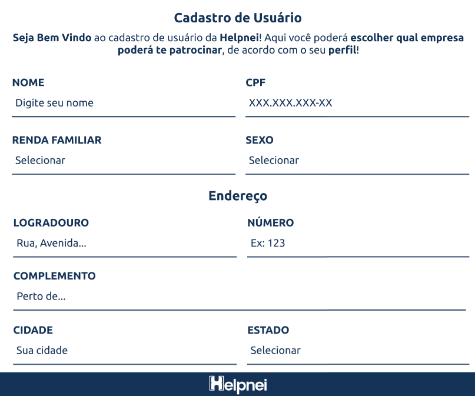

# The Devs Department

Bem-vindo ao repositório oficial da The Devs Department! Este projeto está sendo desenvolvido como parte do trabalho do 2º Semestre de DSM na Fatec São José dos Campos, em parceria com a empresa **Helpnei**.

> **Projeto SCRUM**: Foco em proatividade, autonomia, colaboração e entrega de resultados.

📌 **Nosso [contato](#equipe)** está no final do README!  

## 📌 Visão do Projeto 
O projeto consiste no desenvolvimento de um Dashboard de Indicadores para a Helpnei, que centraliza e exibe, de forma ágil e interativa, dados essenciais relativos a lojas, usuários e transações. Com uma interface intuitiva e responsiva, serão apresentados indicadores como o número de lojas criadas, usuários impactados e a distribuição geográfica, permitindo o acompanhamento do desempenho da plataforma.

Além disso, o dashboard incorpora recursos de filtragem por período e localização, com gráficos dinâmicos e mapas interativos que possibilitam análises comparativas e detalhadas. Essa solução simplifica a visualização dos dados, facilita a comunicação com parceiros e patrocinadores, e apoiando a tomada de decisões estratégicas para o crescimento da empresa ou até mesmo para a Helpnei identificar quais empresas estão trazendo maior expansão para a plataforma.

---

## 🗓️ Cronograma 
| Entrega              | Período               | Status         | Relatório                 |
|----------------------|-----------------------|----------------|---------------------------|
| **Kick Off**         | 24/02 – 28/02/2025    | ✅ Concluído   |       |
| **Sprint 1**         | 10/03 – 30/03/2025    | ✅ Concluído   | [ver relatório](docs/sprints/sprint1/Sprint1.md)   |
| **Sprint 2**         | 07/04 – 27/04/2025    | ✅ Concluído   | [ver relatório](docs/sprints/sprint2/Sprint2.md)      |
| **Sprint 3**         | 05/05 – 25/05/2025    | ✅ Concluído   | [ver relatório](docs/sprints/sprint3/Sprint3.md)      |
| **Feira de Soluções**| 29/05/2025            | ⌛ Planejado   |      |

---

## 📊 Product Backlog  

| Ranking | Prioridade | User Story | Estimativa (1-100) | Sprint | **Req. do Parceiro** |
|---------|------------|------------|--------------------|--------|----------------------|
| **1** | **Alta** | Como Administrador, quero acessar um painel de controle básico, onde posso visualizar os principais indicadores do sistema. | **40** | Sprint 1 | RF-01 |
| **2** | **Alta** | Como Administrador, quero que o sistema tenha um banco de dados estruturado para armazenar informações sobre usuários e lojas. | **60** | Sprint 1 | RNF-02 |
| **3** | **Alta** | Como usuário, quero preencher um formulário de inscrição com meus dados pessoais e socioeconômicos para participar do programa de patrocínio. | **35** | Sprint 2 | RF-05 |
| **4** | **Alta** | Como usuário, quero visualizar uma lista de empresas patrocinadoras disponíveis para mim, incluindo logo e detalhes relevantes, para escolher a melhor opção. | **30** | Sprint 2 | RF-06 |
| **5** | **Alta** | Como empresa patrocinadora, quero definir critérios para selecionar os usuários que desejo apoiar, para garantir que o patrocínio atenda ao meu público-alvo. | **45** | Sprint 2 | RF-07 |
| **6** | **Média** | Como patrocinador, quero visualizar o número total de lojas criadas, para entender a abrangência da plataforma. | **40** | Sprint 2 | RF-02 |
| **7** | **Média** | Como patrocinador, quero visualizar o número de usuários impactados para medir o alcance do projeto. | **40** | Sprint 2 | RF-03 |
| **8** | **Média** | Como usuário, quero acessar uma página onde posso visualizar e escolher entre diferentes empresas patrocinadoras, para selecionar aquela que mais se alinha ao meu perfil e interesses. | **40** | Sprint 2 | RF-04 |
| **9** | **Alta** | Como administrador, quero visualizar a distribuição geográfica das lojas e usuários para entender onde a plataforma tem maior impacto. | **40** | Sprint 3 | RF-10 |
| **10** | **Alta** | Como administrador, quero um gráfico mostrando o engajamento e uso da plataforma, permitindo acompanhar tendências de crescimento. | **85** | Sprint 3 | RF-11 |
| **11** | **Alta** | Como administrador, quero aplicar filtros nos indicadores do dashboard, para visualizar dados específicos e facilitar a análise. | **45** | Sprint 3 | RF-09 |
| **12** | **Média** | Como usuário, quero poder acessar um manual de uso do sistema para entender melhor suas funcionalidades. | **40** | Sprint 3 | RNF-01 |
| **13** | **Baixa** | Como patrocinador, quero que a interface do dashboard seja intuitiva e com design melhorado, incluindo cores nos cards para facilitar a interpretação dos dados. | **45** | Sprint 3 | RF-01 |
| **14** | **Baixa** | Como empresa patrocinadora, quero aplicar filtros como estado, idade, escolaridade e renda familiar para encontrar usuários compatíveis com o meu programa de patrocínio. | **45** | Sprint 3 | RF-08 |

------

## 📂 Sprint Backlog 
[Visualizar Sprint Backlog](docs/entrega/Sprint%20Backlog.pdf)

------

## 📄 Documentos 
- 📃 **DoD** (Já feito) – critérios e entregas já concluídas: [`docs/dod_geral.pdf`](./docs/sprints/sprint1/DoD-sprint1.pdf)
- 📌 **DoR** (Pronto para iniciar) – critérios para começar uma tarefa: [`docs/dor_geral.pdf`](docs/entrega/DoR-sprint2.pdf)
- 🗂️ **Sprint Backlogs** – com tarefas das Sprints 1, 2 e 3: [`docs/sprint_backlogs.pdf`](docs/entrega/Sprint%20Backlog.pdf)
- 📘 **Manual do Usuário** – instruções para uso do sistema: [`docs/manual_usuario.pdf`](docs/sprints/sprint3/ManualDoUsuario.pdf)

------

## 🎨 Protótipo & Mockups 
Visão inicial da interface do **Dashboard Helpnei**, desenvolvida para validar a experiência do usuário antes da implementação.

  

  

  

------

## 🛠️ Tecnologias Utilizadas 

  

    
    
    
    
    
    
    
    
    
    
  

------

## 👥 Equipe 

  

| Função           | Nome                  | Links                                                                                                                                      |  
|-------------------|-----------------------|--------------------------------------------------------------------------------------------------------------------------------------------|  
| **Product Owner**      | Gustavo Almeida       | [LinkedIn](https://www.linkedin.com/in/gustavo-almeida-camargo/) • [GitHub](https://github.com/GustavoAC0802)                              |  
| **Scrum Master**      | Tatiane Oliveira      | [LinkedIn](https://www.linkedin.com/in/tatiane-oliveira-a66789296/) • [GitHub](https://github.com/TatianeOliveira8)                        |  
| **Dev Team**      | Pedro Alves           | [LinkedIn](https://www.linkedin.com/in/pedro-alves-579a93140/) • [GitHub](https://github.com/pphvaz)                                       |  
| **Dev Team**      | Nicoly Guedes         | [LinkedIn](https://www.linkedin.com/in/nicoly-guedes-dev/) • [GitHub](https://github.com/nicolygz)                                         |  
| **Dev Team**      | Guilherme Almeida     | [LinkedIn](https://www.linkedin.com/in/guilherme-almeida-profile/) • [GitHub](https://github.com/AlmdGuilherme)                            |  
| **Dev Team**      | Pedro Martins         | [LinkedIn](https://www.linkedin.com/in/pedro-henrique-martins-55a0752a4/) • [GitHub](https://github.com/pedro-h-martins)                   |  
| **Dev Team**      | Otávio Vianna         | [LinkedIn](https://www.linkedin.com/in/ot%C3%A1vio-vianna-lima-1b26a932a/) • [GitHub](https://github.com/tuzzooz)                         |  
| **Dev Team**      | Issami Umeoka         | [LinkedIn](https://www.linkedin.com/in/issami-umeoka-786716226/) • [GitHub](https://github.com/IssamiU)                                   |  
| **Dev Team**      | Tiago Freitas         | [LinkedIn](https://www.linkedin.com/in/tiago-freitas-74730b2a9/) • [GitHub](https://github.com/tiagow2)                                   |  

---

## 🎥 Vídeo do Projeto em Funcionamento

- [🔗 Vídeo no YouTube](https://youtu.be/bwsLHyKiF4Y)
