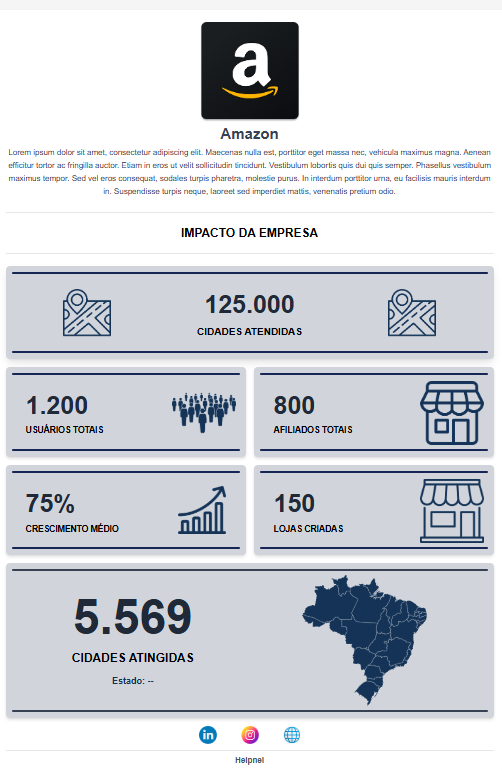
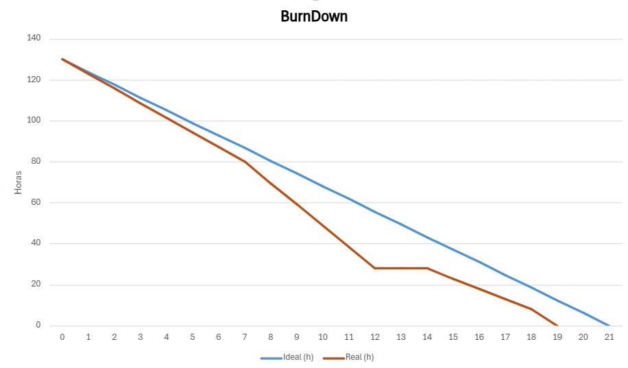

# 📌 Sprint 1 – Relatório Técnico

> **Período da Sprint:** 10/03 a 30/03/2025  
> **Status:** ✅ Concluída  

---

## 🎯 Objetivo da Sprint

O projeto se baseia no desenvolvimento de um dashboard para os usuários da empresa Helpnei, com foco na visualização de dados e impactos relacionados a empresa. O objetivo é oferecer uma ferramenta que permita a essas empresas e usuários acompanharem métricas e indicadores de forma clara e acessível.

Na primeira sprint, o foco foi na criação da base estrutural do sistema, envolvendo a modelagem do banco de dados, a configuração do back-end e a construção inicial da interface. Foram realizadas tarefas como definição do layout geral, validação dos wireframes e implementação das primeiras telas com foco em responsividade. Além disso, foi criada a estrutura do banco de dados em MySQL, com seu respectivo modelo entidade-relacionamento (MER), e configurado o servidor para comunicação com o banco e a API.

Com isso, foi possível entregar uma primeira versão funcional, contendo o fluxo básico de estruturação da aplicação e layout inicial do dashboard. Essa base garante suporte para a implementação futura das funcionalidades de visualização de impacto, conforme esperado pelas empresas.

---

## ✅ Tarefas Concluídas

1. **Definir Layout Geral**  
   *Como usuário, quero que o sistema tenha um layout bem definido para que eu consiga navegar com facilidade e entender onde estão as informações que preciso.*

2. **Ajuste de Design conforme o Feedback**  
   *Como usuário, quero que os ajustes visuais do sistema sigam meu feedback para que a interface fique mais alinhada às minhas necessidades.*

3. **Validação do Wireframe**  
   *Como usuário, quero validar o wireframe antes do desenvolvimento para garantir que a estrutura da interface está correta desde o início.*

4. **Criação da Estrutura Básica das Telas**  
   *Como desenvolvedor, quero criar a estrutura básica das telas para iniciar o desenvolvimento com uma base organizada.*

5. **Implementação do Layout Responsivo**  
   *Como usuário, quero acessar o sistema em diferentes dispositivos para ter flexibilidade no uso.*

6. **Estilização das Telas com Base no Design Validado**  
   *Como usuário, quero que o visual das telas siga o design validado para que o sistema seja agradável e fácil de usar.*

7. **Desenvolver os Dashboards com Base no Wireframe**  
   *Como usuário, quero dashboards construídos conforme o wireframe para visualizar meus dados com clareza.*

8. **Criar Seções para Gráficos e Métricas**  
   *Como usuário, quero seções organizadas com gráficos e métricas para acompanhar o desempenho da minha empresa.*

9. **Modelar o Banco de Dados com Base nos Requisitos**  
   *Como desenvolvedor, quero modelar o banco de dados com base nos requisitos para garantir o armazenamento correto das informações.*

10. **Criação do Modelo Entidade Relacionamento (MER)**  
   *Como desenvolvedor, quero representar visualmente as entidades e relações do sistema para facilitar a implementação.*

11. **Implementar no MySQL**  
   *Como desenvolvedor, quero implementar o modelo no MySQL para estruturar e armazenar os dados do sistema.*

12. **Configurar um Servidor Backend**  
   *Como desenvolvedor, quero configurar um servidor para permitir a comunicação entre front-end e banco de dados.*

13. **Teste de Requisição**  
   *Como desenvolvedor, quero testar as requisições para garantir que os dados estão sendo enviados e recebidos corretamente.*

14. **Estabelecer Conexão com o Banco de Dados**  
   *Como desenvolvedor, quero conectar o backend ao banco de dados para permitir o acesso e manipulação das informações.*

---

## 🎨 Design da Sprint

---

## 📊 Burndown Chart

> 📈 **Observação:** O burndown ficou abaixo da linha ideal nesta sprint, pois houve uma contribuição significativa de toda a equipe logo na primeira semana. Embora os finais de semana não estivessem no planejamento original, alguns desenvolvedores optaram por trabalhar nesses dias, o que adiantou consideravelmente a entrega.

---

## 📎 Documentos da Sprint

- [📄 Definition of Ready (DoR) – Sprint 1](./docs/sprints/sprint1/DoR-sprint1.pdf)  
- [📄 Definition of Done (DoD) – Sprint 1](./docs/sprints/sprint1/DoD-sprint1.pdf)  
- [📄 Product Backlog – Sprint 1](./docs/sprints/sprint1/ProductBacklog-sprint1.pdf)

