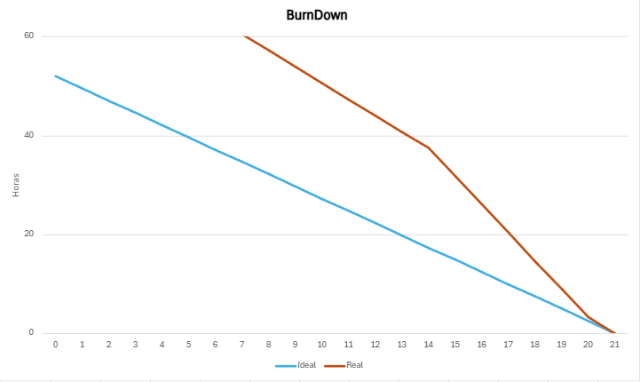

# 📌 Sprint 2 – Relatório Técnico

> **Período da Sprint:** 07/04 a 27/04/2025  
> **Status:** ✅ Concluída  
> **Scrum Master:** Tatiane Oliveira  
> **Equipe:** The Devs Department

---

## 🎯 Objetivo da Sprint

O projeto se baseia no desenvolvimento de um dashboard para os usuários da empresa Helpnei, especificamente para as empresas afiliadas, com foco na visualização de dados e impactos relacionados aos produtos. O objetivo é oferecer uma ferramenta que permita a essas empresas e usuários acompanharem métricas e indicadores de forma clara e acessíve
Na segunda sprint, recebemos o desafio de realizar o desenvolvimento de uma página de cadastro juntamente com uma página de recomendações de empresas. Durante a sprint, foi realizado o desenvolvimento das novas telas e a API Rest e o banco de dados foi alimentado com algumas informações.
Com isso, nessa sprint, foi possível entregar as novas telas totalmente funcionais, dando abertura para novas implementações na próxima sprint

---

## ✅ Tarefas Concluídas

| Tarefa |
| --- |
| Definir Layout Geral |
| Ajuste de Design conforme o Feedback |
| Validação do wireframe |
| Criação da estrutura básica da(s) tela(s) |
| Implementação do Layout Responsivo para diferentes dispositivos |
| Estilização das telas com base no Design Validado |
| Criar seções para métricas |
| Modelar o Banco de Dados com base nos requisitos |

---

## 🎨 Designs da Sprint

  

  

  

---

## 📊 Burndown Chart

  

---

## 📎 Documentos da Sprint

- [📄 Sprint Backlog – Sprint 2](./SprintBacklogS2.pdf)  
- [📄 Product Backlog – Sprint 2](./S2-ProductBacklog.pdf)

---

## 🎥 Vídeo do Projeto em Funcionamento

- [🔗 Vídeo no YouTube](https://youtu.be/bwsLHyKiF4Y)
